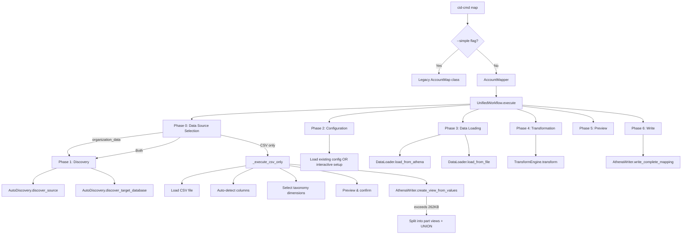

# Design Document: Advanced Account Mapper

## Overview

The Advanced Account Mapper replaces the default `cid-cmd map` behavior with an interactive workflow that creates enriched `account_map` Athena views with custom taxonomy dimensions. It supports multiple data sources (tags, OU hierarchy levels, CSV files, account name splitting) and persists configuration for repeatable runs.

The legacy behavior is preserved via `cid-cmd map --simple`.

## Architecture



## Components and Interfaces

### 1. `AccountMapper` class (`cid/helpers/account_mapper.py`)

High-level entry point. Delegates to `UnifiedWorkflow`.

```python
class AccountMapper:
    def __init__(self, athena: Athena, view_name: str = 'account_map')
    def create_mapping(self, source_file=None, source_database=None) -> dict
    def view_config(self, database=None) -> None
```

### 2. `UnifiedWorkflow` class (`cid/helpers/account_mapper_helpers.py`)

Orchestrates the workflow. Key methods:

- `execute(source_file, source_database)` — main entry point
- `_prompt_data_source_mode(source_file)` — asks user to choose data source: `athena`, `csv_only`, or `both`
- `_execute_csv_only(source_file)` — complete CSV-only workflow (no Athena source table required)
- `_interactive_configuration(database, table, source_file)` — builds config from user choices
- `_discover_hierarchy_levels(database, table)` — queries OU depth and sample names
- `_prompt_payer_names(config, org_data)` — assigns friendly names to management accounts
- `_preview_and_confirm(sql, sample_data)` — shows SQL + sample table for confirmation
- `_check_existing_config(database)` — loads saved config from `account_map_config` view
- `_prompt_config_reuse(config)` — displays existing config and asks to reuse

### 3. `AutoDiscovery` class

Handles database/table/tag discovery with smart auto-selection:

- `discover_source()` — finds `organization_data` table, auto-selects if only one match
- `discover_target_database()` — suggests database for output views
- `discover_tag_keys(database, table)` — extracts unique tag keys from `hierarchytags`
- `discover_account_id_column(data)` — auto-detects account ID column in file data

### 4. `ConfigManager` class

Persists/loads configuration as an Athena view (`account_map_config`) using a two-row-type structure:

- `save_to_view(config, database)` — generates VALUES-based view SQL
- `load_from_view(database)` — reads config rows back into structured dict
- `parse_config_rows(rows)` / `generate_config_rows(config)` — serialization

Config structure:
```python
{
    'metadata': {
        'source_database': 'optimization_data',
        'source_table': 'organization_data',
        'target_database': 'cid_cur',
        'file_source_view': 'account_map_file_source'  # optional
    },
    'taxonomy_dimensions': [
        {'name': 'environment', 'source_type': 'tag', 'source_value': 'environment'},
        {'name': 'business_unit', 'source_type': 'ou_level', 'source_value': 2},
        {'name': 'team', 'source_type': 'file', 'source_value': 'team_column'},
        {'name': 'product', 'source_type': 'name_split', 'source_value': {'separator': '-', 'index': 1}}
    ],
    'payer_names': {
        '123456789012': 'Production Org'
    }
}
```

### 5. `TransformEngine` class

Applies taxonomy rules to org data for preview output:

- `transform()` — creates Account instances, applies rules, returns List[Dict]
- `apply_single_rule(rule, account_id)` — dispatches to extraction functions

### 6. `DataLoader` class

- `load_from_athena()` — queries `organization_data` with hierarchy/tags parsing
- `load_from_file(file_path)` — reads CSV via `csv.DictReader`

### 7. `AthenaWriter` class

- `write_complete_mapping(config, rows, database, view_name)` — orchestrates view creation
- `create_account_map_view(config, rows, view_name, database)` — generates transformation SQL
- `create_view_from_values(rows, view_name, database)` — creates VALUES-based views, auto-splits if > 262KB
- `create_union_view(view_names, union_view_name, database)` — creates UNION ALL view over split parts
- `_generate_values_sql(rows, view_name, database, columns)` — generates SQL with explicit CAST to VARCHAR
- `_create_split_views(rows, view_name, database, columns)` — splits rows into chunks that fit under Athena's SQL size limit

### 8. Extraction functions (module-level)

- `extract_from_tag(org_data, account_id, tag_key)` — reads from `hierarchytags`
- `extract_from_hierarchy(org_data, account_id, level_index)` — reads OU name at level N
- `extract_from_account_name(org_data, account_id, separator, index)` — splits name
- `extract_from_file(file_data, account_id, column_name, account_id_column)` — joins by ID

## Taxonomy Dimension Source Types

| source_type | source_value | SQL Generated | Description |
|---|---|---|---|
| `tag` | `"environment"` | `element_at(filter(org.hierarchytags, x -> x.key = 'environment'), 1).value` | Extracts tag value by key |
| `ou_level` | `2` | `TRY(org.hierarchy[2].name)` | Extracts OU name at hierarchy level |
| `file` | `"team_column"` | `file.team_column` | Joins from file source view |
| `name_split` | `{"separator": "-", "index": 1}` | `split_part(org.name, '-', 2)` | Splits account name |

## Generated SQL Example

```sql
CREATE OR REPLACE VIEW cid_cur.account_map AS
SELECT
    org.id AS account_id,
    org.name AS account_name,
    org.managementaccountid AS parent_account_id,
    CASE
        WHEN org.managementaccountid = '123456789012' THEN 'MyOrg'
        ELSE org.managementaccountid
    END AS parent_account_name,
    TRY(org.hierarchy[2].name) AS business_unit,
    element_at(
        filter(org.hierarchytags, x -> x.key = 'environment'),
        1
    ).value AS environment,
    split_part(org.name, '-', 2) AS product
FROM optimization_data.organization_data org
```

## Views Created

| View | Purpose |
|---|---|
| `account_map` | Main enriched account mapping view used by dashboards |
| `account_map_config` | Stores configuration for reuse on subsequent runs |
| `account_map_file_source` | (With `--file` or CSV-only mode) Stores file/CSV data as an Athena view |

## Output Column Compatibility

The output columns are compatible with the legacy `account_map_cur2.sql` template:

| Column | Source (org_data mode) | Source (CSV-only mode) |
|---|---|---|
| `account_id` | `org.id` | CSV account_id column |
| `account_name` | `org.name` | CSV account_name column (or account_id) |
| `parent_account_id` | `org.managementaccountid` | NULL |
| `parent_account_name` | CASE expression from `payer_names` config | NULL |
| (taxonomy dimensions) | Configured by user | Selected CSV columns (optionally renamed) |

## Data Source Modes

The workflow begins by asking the user which data source to use:

| Mode | Description | Athena table required? |
|---|---|---|
| `organization_data table` | Uses organization_data collected via CID Data Collection | Yes |
| `CSV file only` | Uses a CSV file as the sole account source | No |
| `Both` | Uses organization_data + CSV for additional taxonomy columns | Yes |

### CSV-only mode (`_execute_csv_only`)

When the user selects "CSV file only":
1. Prompts for file path (or uses `--file` if provided)
2. Auto-detects `account_id` and `account_name` columns
3. Remaining columns are offered as taxonomy dimensions
4. Optionally rename the selected columns to friendly, SQL-safe dimension
   names (same prompt as the organization_data workflow; default keeps the
   original CSV header). Renamed names become the output view column names.
5. Rows are normalized (zero-padded account IDs, `parent_account_id` and
   `parent_account_name` as NULL for dashboard compatibility)
6. Writes through the same `AthenaWriter.write_complete_mapping()` orchestrator
   as the other modes: orphan part-view cleanup, then the normalized rows are
   materialized as the `account_map_file_source` VALUES view (auto-split into
   part views + UNION if > 262KB), the config view is saved, and `account_map`
   is created as a thin `SELECT ... FROM account_map_file_source` view.

### Both mode

When the user selects "Both":
1. Discovers `organization_data` table in Athena (base account list)
2. Prompts for CSV file path if `--file` not provided
3. CSV columns are available as "Additional file" taxonomy dimensions alongside tags, OU levels, etc.

## CLI Interface

```
cid-cmd map [--simple] [--file PATH] [--database TEXT] [--view-name TEXT]
```

- No flags: interactive advanced mode (prompts for data source mode)
- `--simple`: legacy mode (AccountMap class)
- `--file`: path to CSV file; used in "CSV only" or "Both" modes
- `--database`: skips auto-discovery of source database
- `--view-name`: custom output view name (default: `account_map`)

## Integration with Dashboard Flows

The advanced mapper is ONLY invoked via `cid-cmd map`. Dashboard `deploy`/`update` commands continue using the legacy `AccountMap` class via `create_or_update_account_map()`. This ensures no impact on existing deployment workflows.

## SQL Generation Details

### VALUES-based views (CSV-only and file source)

Generated SQL wraps the VALUES clause with explicit CAST to handle all-NULL columns:

```sql
CREATE OR REPLACE VIEW database.view_name AS
SELECT CAST("account_id" AS VARCHAR) AS "account_id",
       CAST("account_name" AS VARCHAR) AS "account_name",
       CAST("parent_account_id" AS VARCHAR) AS "parent_account_id",
       CAST("parent_account_name" AS VARCHAR) AS "parent_account_name",
       CAST("business_unit" AS VARCHAR) AS "business_unit"
FROM (
  VALUES
  ('123456789012', 'Account 1', NULL, NULL, 'Engineering'),
  ('987654321098', 'Account 2', NULL, NULL, 'Operations')
) AS t ("account_id", "account_name", "parent_account_id", "parent_account_name", "business_unit")
```

### Splitting for large datasets

Athena has a 262,144 byte SQL statement limit. When the generated SQL exceeds this:
1. Data is split into chunks (halving until each fits)
2. Part views are created: `account_map_part1`, `account_map_part2`, etc.
3. A union view combines them: `CREATE OR REPLACE VIEW account_map AS SELECT * FROM part1 UNION ALL SELECT * FROM part2`

All view creation uses `CREATE OR REPLACE VIEW` — no `DROP VIEW` is issued, avoiding the need for `glue:DeleteTable` permissions.

## Security Considerations

- SQL identifiers (database, table, view names) are interpolated via f-strings — consistent with the rest of the codebase. Acceptable because this is a CLI tool where the user operates on their own AWS account.
- Separator values for `name_split` are validated against `ALLOWED_SEPARATORS` and sanitized for SQL.
- Dimension names are validated as SQL identifiers (alphanumeric + underscore, no reserved words).
- Config view values escape single quotes for SQL string literals.

## File Structure

```
cid/helpers/account_mapper.py          # High-level AccountMapper class (entry point)
cid/helpers/account_mapper_helpers.py  # All implementation classes (~3300 lines)
```
