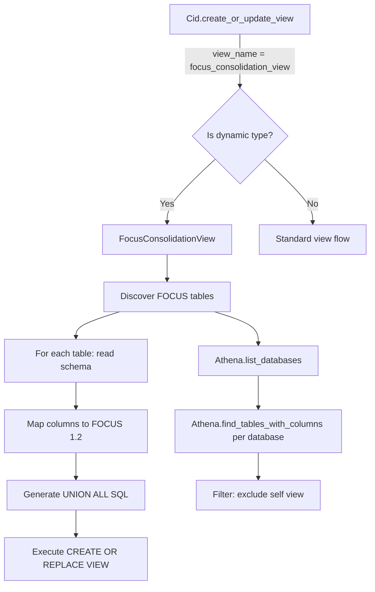

# Design Document: Dynamic FOCUS Consolidation View

## Overview

This feature replaces the static `focus_consolidation_view` SQL with a dynamic view generator that discovers FOCUS tables across all Athena databases, maps their columns to the FOCUS 1.2 target schema, and generates a `CREATE OR REPLACE VIEW` with `UNION ALL` across all discovered tables.

The design follows the existing `ProxyView` pattern in `cid/helpers/cur_proxy.py`, which dynamically generates CUR proxy views by reading source table schemas, mapping columns, and using NULL placeholders for missing columns.

## Architecture



## Components and Interfaces

### 1. `FocusConsolidationView` class (`cid/helpers/focus_consolidation.py`)

This is the core new component. It follows the `ProxyView` pattern.

```python
class FocusConsolidationView:
    """Dynamically generates a FOCUS consolidation view by discovering
    and unioning all FOCUS tables across Athena databases."""

    def __init__(self, athena: Athena, columns: dict = None):
        self.athena = athena
        self.name = 'focus_consolidation_view'
        # Use columns from YAML config if provided, otherwise fall back to defaults
        self.columns = columns if columns else DEFAULT_FOCUS_1_2_COLUMNS

    def discover_focus_tables(self) -> list[dict]:
        """Discover all FOCUS tables across all Athena databases.
        Returns list of dicts with keys: database, table_name, columns.
        Excludes the consolidation view itself."""
        ...

    def generate_select_for_table(self, table_info: dict) -> str:
        """Generate a SELECT statement for a single source table,
        mapping its columns to the FOCUS 1.2 target schema.
        Handles type casting, NULL placeholders, and billing_period logic."""
        ...

    def generate_view_sql(self, tables: list[dict]) -> str:
        """Generate the full CREATE OR REPLACE VIEW SQL with UNION ALL
        across all discovered tables."""
        ...

    def create_or_update_view(self) -> bool:
        """Main entry point. Discovers tables, generates SQL, executes it.
        Returns True if view was created/updated, False if no tables found."""
        ...
```

### 2. Integration point in `Cid.create_or_update_view()` (`cid/common.py`)

The existing `create_or_update_view` method is modified to detect when a view definition has `type: dynamic_focus_consolidation` and delegate to `FocusConsolidationView` instead of the standard SQL template flow.

```python
# In create_or_update_view, after getting view_definition:
if view_definition.get('type') == 'dynamic_focus_consolidation':
    from cid.helpers.focus_consolidation import FocusConsolidationView
    columns = view_definition.get('columns')
    focus_view = FocusConsolidationView(athena=self.athena, columns=columns)
    focus_view.create_or_update_view()
    return
```

### 3. Updated `focus.yaml` view definition

The `focus_consolidation_view` entry in `focus.yaml` is updated to:
- Set `type: dynamic_focus_consolidation`
- Define `columns:` dict mapping column names to Athena types (the single source of truth for the FOCUS 1.2 target schema)
- Remove the `data:` placeholder SQL (not needed — columns are defined declaratively and SQL is generated dynamically)
- Remove the `parameters` section (no longer needed since tables are discovered dynamically)


## Data Models

### FOCUS 1.2 Target Schema

The FOCUS 1.2 target columns are defined in `focus.yaml` under `focus_consolidation_view.columns` as the single source of truth. The Python module `focus_consolidation.py` contains a `DEFAULT_FOCUS_1_2_COLUMNS` fallback dict used only when columns are not provided via YAML configuration.

YAML definition (in `dashboards/focus/focus.yaml`):

```yaml
focus_consolidation_view:
  type: dynamic_focus_consolidation
  columns:
    availabilityzone: varchar
    billedcost: double
    billingaccountid: varchar
    ...
    tags: map<varchar,varchar>
    billing_period: varchar
```

Python fallback (in `cid/helpers/focus_consolidation.py`):

```python
# Default FOCUS 1.2 target columns — used as fallback when columns
# are not provided via YAML configuration.
DEFAULT_FOCUS_1_2_COLUMNS = {
    'availabilityzone': 'varchar',
    'billedcost': 'double',
    ...
    'tags': 'map<varchar,varchar>',
    'billing_period': 'varchar',
}
```

### FOCUS 1.0 Minimum Columns (for discovery)

```python
# Minimum columns that identify a table as FOCUS-compliant
FOCUS_MINIMUM_COLUMNS = [
    'billedcost',
    'billingaccountid',
    'billingcurrency',
    'billingperiodstart',
    'chargecategory',
    'effectivecost',
    'listcost',
    'providername',
    'servicename',
    'subaccountid',
]
```

### NULL Type Mapping

Reuses the pattern from `cur_proxy.py`:

```python
NULL_EXPRESSIONS = {
    'varchar': 'CAST(NULL AS VARCHAR)',
    'double': 'CAST(NULL AS DOUBLE)',
    'timestamp': 'CAST(NULL AS TIMESTAMP)',
    'date': 'CAST(NULL AS DATE)',
    'bigint': 'CAST(NULL AS BIGINT)',
    'map<varchar,varchar>': 'CAST(NULL AS MAP<VARCHAR,VARCHAR>)',
}
```

### Discovered Table Info

Each discovered table is represented as a dict:

```python
{
    'database': 'cid_data_export',
    'table_name': 'focus',
    'columns': {
        'billedcost': 'double',
        'billingaccountid': 'varchar',
        'billing_period': 'varchar',
        ...
    },
    'partition_keys': ['billing_period']  # from table metadata
}
```

## Column Mapping Logic

For each target column in FOCUS 1.2, and for each source table:

1. **Column exists with matching type**: Use column directly → `billedcost`
2. **Column exists with different type**: Cast to target type → `CAST(billingperiodstart AS TIMESTAMP)`
3. **Column missing**: Use typed NULL → `CAST(NULL AS DOUBLE) AS billedcost`

### Special case: `billing_period`

- If `billing_period` exists in source table columns or partition keys → use it directly
- If `billing_period` is absent → compute as `date_format(CAST(billingperiodstart AS DATE), '%Y-%m')`

### Special case: `tags`

- If `tags` column exists in source → use it directly
- If `tags` column is missing → `CAST(NULL AS MAP<VARCHAR,VARCHAR>) AS tags`

## SQL Generation

The generated SQL follows this structure:

```sql
CREATE OR REPLACE VIEW "focus_consolidation_view" AS
SELECT
    availabilityzone
  , billedcost
  , ...
  , billing_period
FROM "database1"."table1"

UNION ALL

SELECT
    CAST(NULL AS VARCHAR) AS availabilityzone
  , billedcost
  , ...
  , date_format(CAST(billingperiodstart AS DATE), '%Y-%m') AS billing_period
FROM "database2"."table2"
```

Each SELECT block has exactly the same columns in the same order, ensuring UNION ALL compatibility.


## Correctness Properties

*A property is a characteristic or behavior that should hold true across all valid executions of a system — essentially, a formal statement about what the system should do. Properties serve as the bridge between human-readable specifications and machine-verifiable correctness guarantees.*

### Property 1: Discovery identifies exactly the FOCUS tables

*For any* set of Athena databases containing arbitrary tables, `discover_focus_tables` should return exactly those tables whose column names (lowercased) are a superset of `FOCUS_MINIMUM_COLUMNS`, regardless of database name, and should exclude the consolidation view itself.

**Validates: Requirements 1.1, 1.2, 1.3, 1.4, 3.3**

### Property 2: Column expression correctness

*For any* source table column set and *for any* target FOCUS 1.2 column, `generate_select_for_table` should produce:
- The column name directly if it exists in the source with matching type
- A `CAST(<column> AS <target_type>)` expression if the column exists but with a different type
- A `CAST(NULL AS <target_type>)` expression if the column is missing from the source

**Validates: Requirements 2.2, 2.3**

### Property 3: billing_period special handling

*For any* source table, if `billing_period` exists as a column or partition key, the generated expression should use it directly. If `billing_period` is absent, the generated expression should be `date_format(CAST(billingperiodstart AS DATE), '%Y-%m')`.

**Validates: Requirements 2.4**

### Property 4: Generated SQL includes all FOCUS 1.2 columns

*For any* non-empty set of discovered FOCUS tables, the generated SQL should contain exactly the 58 FOCUS 1.2 column names in each SELECT block, in the same order.

**Validates: Requirements 2.1**

### Property 5: Generated SQL uses CREATE OR REPLACE VIEW

*For any* non-empty set of discovered FOCUS tables, the generated SQL should begin with `CREATE OR REPLACE VIEW`.

**Validates: Requirements 3.1**

### Property 6: UNION ALL structure matches discovered tables

*For any* N discovered FOCUS tables (N ≥ 1), the generated SQL should contain exactly N SELECT blocks joined by N-1 `UNION ALL` clauses, and each SELECT should reference the correct `"database"."table"` in its FROM clause.

**Validates: Requirements 1.1, 2.1**

## Error Handling

| Scenario | Behavior |
|---|---|
| No FOCUS tables discovered | Log a warning, do not create the view. Return False from `create_or_update_view()`. The existing view (if any) remains unchanged. |
| AccessDenied on a database | Log warning, skip that database, continue scanning others. Follow the pattern from `CUR.find_cur()`. |
| Table metadata API failure | Log error, skip that database, continue. |
| Unknown column type in source | Default to `VARCHAR` for NULL placeholder. Log a warning. |
| Athena query execution failure | Let the exception propagate (consistent with existing `ProxyView` behavior). |

## Testing Strategy

### Property-Based Tests

Use `hypothesis` library for property-based testing. Each property test runs a minimum of 100 iterations.

Tests are placed in `cid/test/python/test_focus_consolidation.py`.

The `FocusConsolidationView` class methods are designed to be testable without AWS calls:
- `generate_select_for_table()` takes a table info dict and returns SQL string — pure function
- `generate_view_sql()` takes a list of table info dicts and returns SQL string — pure function
- `discover_focus_tables()` depends on Athena API — tested via mocking or integration tests

Property tests focus on the pure SQL generation functions. Discovery is tested with mocked Athena responses.

**Tag format**: `Feature: focus-consolidation-dynamic-view, Property N: <title>`

### Unit Tests

Unit tests cover:
- Edge case: single table discovered (no UNION ALL needed)
- Edge case: table with all FOCUS 1.2 columns (no NULLs needed)
- Edge case: table with only FOCUS 1.0 minimum columns (many NULLs)
- Edge case: billing_period as partition key vs regular column vs absent
- Integration: `create_or_update_view` in `common.py` delegates to `FocusConsolidationView` when type is `dynamic_focus_consolidation`
- YAML update: `focus.yaml` has correct type and `columns:` dict (no placeholder SQL)
